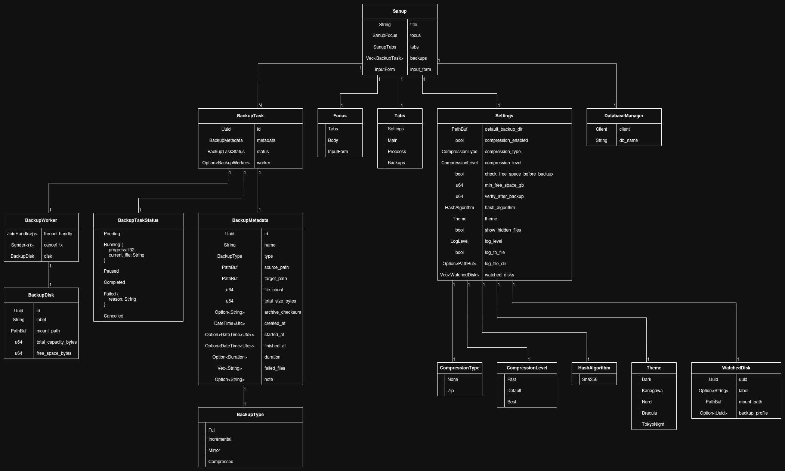
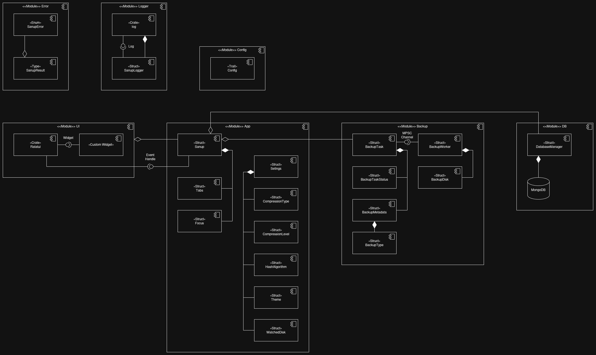
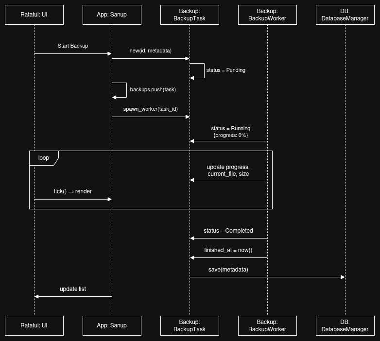
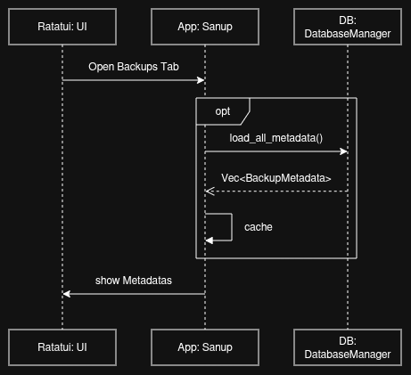
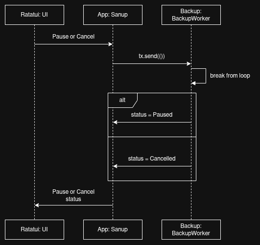
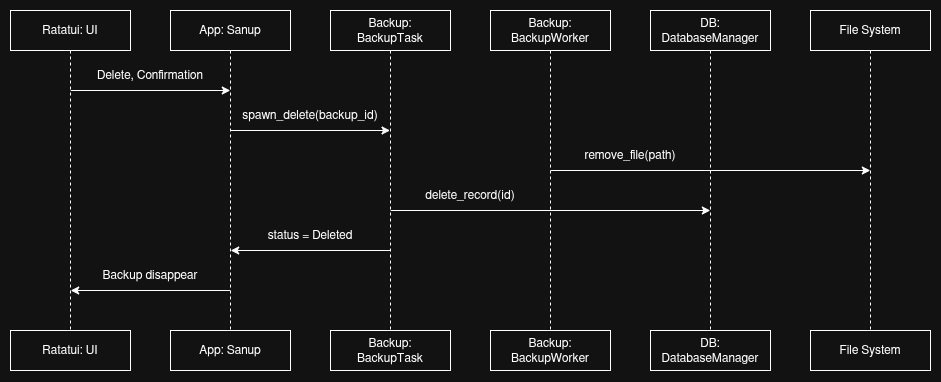
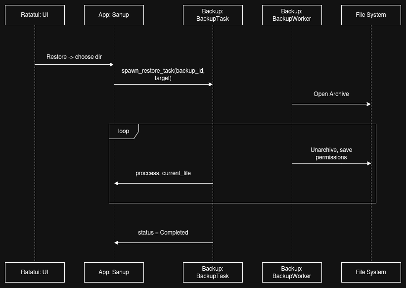
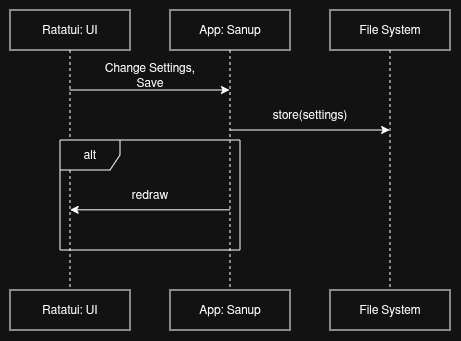

# Sanup


Sanup is a TUI application for creating and managing backups on Linux-based operating systems. Sanup provides an intuitive interface for selecting files and directories, performing backups, and restoring data.

## Features

- **Browse and Select**: Navigate and select files or directories for backup using a vim keymap.
- **Backup Creation**: Create backups with options for compression and customizable destinations.
- **Restore Backups**: Restore files from previous backups with ease.
- **Backup History**: View and manage past backups.
- **Linux-Native**: Optimized for Linux, handling file permissions and paths correctly.

## Installation

### Prerequisites

- Rust (stable, version 1.80 or higher)
- Linux-based OS (e.g., Arch, Manjaro)
- Optional: `zip` or `tar` for compression support

### Steps

1. **Clone the Repository**:

   ```bash
   git clone https://github.com/yourusername/sanup.git
   cd sanup
   ```

2. **Build the Project**:

   ```bash
   cargo build --release
   ```

3. **Run the Application**:

   ```bash
   cargo run --release
   ```

### Arch Linux (AUR)

Sanup is available on the [Arch User Repository (AUR)](https://aur.archlinux.org/). To install (i use [paru](https://github.com/Morganamilo/paru)):

```bash
paru sanup
```

Or use your preferred AUR helper.

## Usage

## Project Structure

### Source code modules

```text
src/
├── app/         Main app (Sanup)
├── ui/          UI logic and custom components
├── backup/      Backup logic (BackupTask, BackupWorker)
├── db/          Database logic (DatabaseManager)
├── config.rs    Config Trait provide logic of save/load Toml
├── error.rs     Error handling logic (SanupError, SanupResult)
```

### ER



### Component



### Sequence

#### Create new backup



#### View backup history



#### Pause or Cancel backup



#### Delete backup



#### Restore



#### Change settings



## Dependencies

## Contributing

## License

This project is licensed under the GNU General Public License v3.0. See the `LICENSE` file for details.

## Contact

For issues or suggestions, please open an issue on the GitHub repository.
